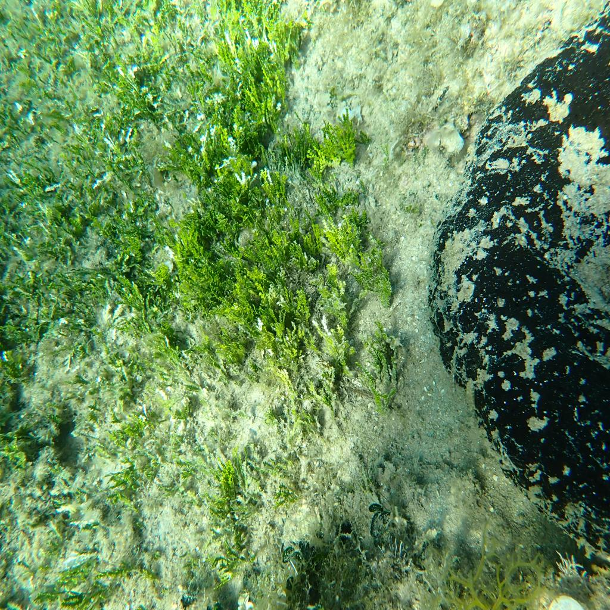

# Halimeda
Repository of the paper:

**A Deep Learning Approach to Estimate Halimeda incrassata Invasive Stage in the Mediterranean Sea **
Caterina Muntaner-Gonzalez, Miguel Martin-Abadal, Yolanda Gonzalez-Cid

[Link to our paper](https://www.mdpi.com/2077-1312/12/1/70)
 
Halimeda incrassata coverage estimation

    
    

This repository aims to provide the necessary tools and knowledge to operate our halimeda incrassata coverage estimation algorithm.

# Installation

To clone the repository do:

`$ git clone --recursive https://github.com/srv/Halimeda.git` 

`$ git submodule update --init --recursive`

`$ git submodule foreach -q --recursive 'branch="$(git config -f $toplevel/.gitmodules submodule.$name.branch)"; git checkout $branch'`

## Object detection enviroment installation

`$ cd object_detection`

`$ conda create -n <environment-name> --file object_req.txt`

### Download object detection model:

[Object detection model](https://zenodo.org/record/7611869#.Y_xsFSbMJD8)

## Semantic segmentation installation

`$ cd semantic_segmentation/SS_Halimeda`

`$ conda env create --file segmentation.yaml`

## Weighted merge ROS implementation:
 
 `$ cd halimeda_detection`

`$ conda env create --file halimeda_merge.yml`
