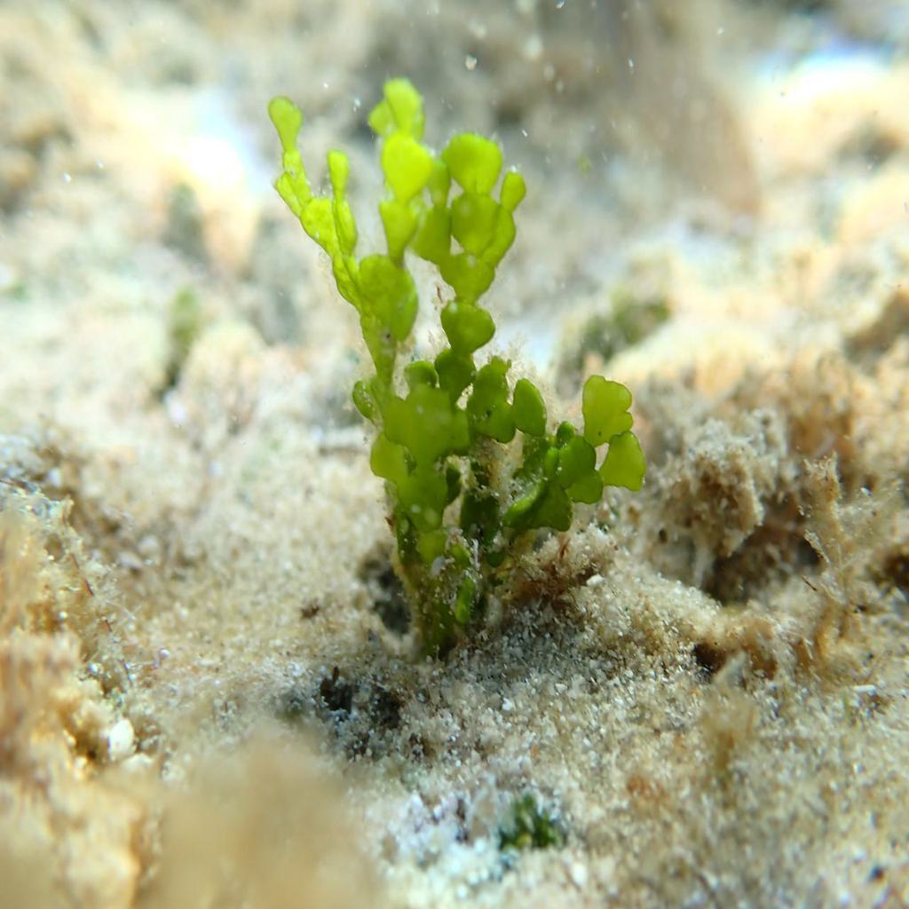

# Halimeda
Halimeda incrassata coverage estimation

 

This repository aims to provide the necessary tools and knowledge to operate our halimeda incrassata coverage estimation algorithm.

# Installation

To clone the repository do:

`$ git clone --recursive https://github.com/srv/Halimeda.git` 

`$ git submodule update --init --recursive`

`$ git submodule foreach -q --recursive 'branch="$(git config -f $toplevel/.gitmodules submodule.$name.branch)"; git checkout $branch'`

## Object detection enviroment installation

`$ cd object_detection`

`$ conda create -n <environment-name> --file object_req.txt`

### Download object detection model:

[Object detection model](https://zenodo.org/record/7611869#.Y_xsFSbMJD8)

## Semantic segmentation installation

`$ cd semantic_segmentation/SS_Halimeda`

`$ conda create -n <environment-name> --file segmentation.yaml`

`$ pip install numba`

`$ pip install tensorflow==2.8`

`$ pip install protobuf==3.20.*`

`$ conda install -c anaconda scipy==1.9.1`

`$ echo $LD_LIBRARY_PATH`

`$ nvcc  --version`

https://stackoverflow.com/questions/66977227/could-not-load-dynamic-library-libcudnn-so-8-when-running-tensorflow-on-ubun

`$ wget https://developer.download.nvidia.com/compute/cuda/repos/ubuntu2004/x86_64/cuda-ubuntu2004.pin`

`$ sudo mv cuda-ubuntu2004.pin /etc/apt/preferences.d/cuda-repository-pin-600`

`$ export last_public_key=3bf863cc` # where ${last_public_key} is the last public key (file with .pub extension) published on https://developer.download.nvidia.com/compute/cuda/repos/ubuntu2004/x86_64/. (At March 8th 2023 when this post was edit, it was 3bf863cc).

`$ sudo apt-key adv --fetch-keys https://developer.download.nvidia.com/compute/cuda/repos/ubuntu2004/x86_64/${last_public_key}.pub`

`$ sudo add-apt-repository "deb https://developer.download.nvidia.com/compute/cuda/repos/ubuntu2004/x86_64/ /"`

`$ sudo apt-get update`

`$ sudo apt-get install libcudnn8`

`$ sudo apt-get install libcudnn8-dev`

To install a specific version, the last 2 commands would be replaced with

`$ sudo apt-get install libcudnn8=${cudnn_version}-1+${cuda_version}`

`$ sudo apt-get install libcudnn8-dev=${cudnn_version}-1+${cuda_version}`

In our case:

`$ sudo apt-get install libcudnn8=8.2.4.*` 

if code does not find cuda or cudnn paths:

`$ sudo ldconfig /home/olivia/anaconda3/envs/ss/lib/`

## Weighted merge ROS implementation:
 
 `$ cd halimeda_detection`

`$ conda create -n <environment-name> --file halimeda_merge.yml`
